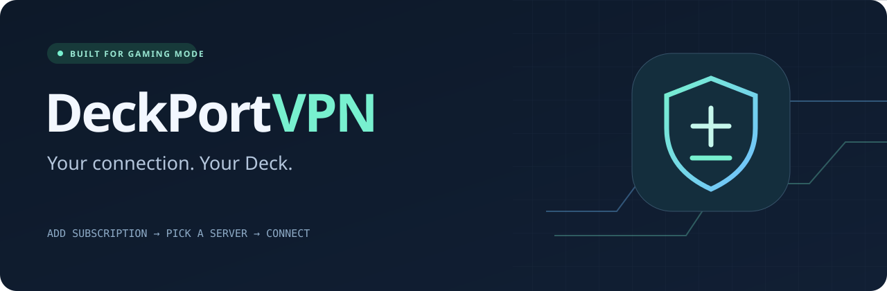

<p align="center">
  
</p>

<h1 align="center">DeckPort VPN</h1>

<p align="center">
  Системный VPN для Steam Deck с интеграцией в Decky Loader.
</p>

<p align="center">
  <a href="README.md">English</a> ·
  <a href="#возможности">Возможности</a> ·
  <a href="#установка">Установка</a> ·
  <a href="#архитектура">Архитектура</a> ·
  <a href="#разработка">Разработка</a>
</p>

<p align="center">
  
  
  
  
  
</p>

---

## О проекте

DeckPort VPN — VPN-клиент с открытым исходным кодом, созданный специально для Steam Deck.

Он обеспечивает системное VPN-подключение, а основное управление доступно прямо через Decky Loader в Gaming Mode.

Начиная с архитектуры 0.2.x, VPN-процесс принадлежит постоянному системному демону. Decky Loader и приложение Desktop Mode подключаются к одному и тому же локальному сервису и больше не управляют VPN-процессом самостоятельно.

Репозиторий проекта: **deckport-haupp**

> DeckPort VPN 0.2.10 — первый стабильный Desktop-релиз. Автоматические Linux-тесты
> не заменяют отдельный acceptance checklist для Steam Deck LCD и OLED.

## Возможности

### Gaming Mode

- интеграция с Decky Loader
- подключение и отключение VPN без выхода из Gaming Mode
- управление подписками
- выбор серверов
- поиск серверов
- проверка TCP-задержки
- сортировка по задержке или имени
- избранные серверы
- отображение публичного IP до и после подключения
- общее состояние VPN с системным демоном
- VPN продолжает работать после закрытия панели Decky

### Desktop Mode

DeckPort VPN также включает клиент для Desktop Mode.

Он работает через тот же системный демон, что и Decky-плагин. Поэтому подписки, выбранный сервер и состояние подключения общие для Gaming Mode и Desktop Mode.

Нативный Desktop-клиент поддерживает состояние VPN, подписки, поиск серверов,
проверку задержки, избранное, настройки, диагностику и доступ к Setup.

### Поддерживаемые протоколы

- VLESS
- VMess
- Trojan
- Shadowsocks
- SOCKS5
- WireGuard

### Поддерживаемые форматы подписок

- обычные списки URI
- Base64-списки URI
- Clash YAML
- Clash JSON
- sing-box JSON
- конфигурации WireGuard
- локальные `.txt`
- локальные `.conf`
- локальные `.json`
- локальные `.yaml`
- локальные `.yml`

Рекомендуется использовать HTTPS-подписки.

HTTP также поддерживается, если провайдер не предоставляет HTTPS, однако HTTP-трафик подписки не шифруется.

## Системная архитектура

DeckPort VPN 0.2.x использует постоянный системный сервис:

- `deckportd.service`
- локальный Unix socket IPC
- проверка Linux peer credentials
- встроенный sing-box
- системная TUN-сеть
- очистка после аварий
- транзакционная установка
- журнал установки
- rollback
- сохранение настроек при обновлении

Интерфейс больше не владеет VPN-процессом.

Закрытие Decky или приложения Desktop Mode не должно отключать активное VPN-соединение.

## Установка

### Требования

- Steam Deck
- SteamOS x86_64
- Decky Loader для интеграции с Gaming Mode
- интернет во время установки
- поддерживаемая VPN-подписка

### Установка 0.2.11

Откройте Konsole в Desktop Mode:

```bash
curl -fL https://raw.githubusercontent.com/stephanstarikov-hub/deckport-haupp/v0.2.11/install.sh -o /tmp/deckport-install.sh
bash /tmp/deckport-install.sh --version 0.2.11
```

Установщик:

1. загружает release payload нужной версии;
2. загружает SHA-256 checksum;
3. проверяет скачанный архив;
4. проверяет пути, типы файлов и права внутри архива;
5. запрашивает системную авторизацию;
6. устанавливает постоянный VPN daemon;
7. устанавливает интеграцию с Desktop Mode;
8. устанавливает или обновляет Decky-плагин;
9. сохраняет существующие настройки DeckPort;
10. сохраняет информацию для rollback.

Устанавливать sing-box через системный пакетный менеджер не требуется.

Отключать read-only режим SteamOS также не требуется.

## Первое подключение

1. Откройте **Decky Loader**.
2. Откройте **DeckPort VPN**.
3. Перейдите в **Subscriptions**.
4. Добавьте URL подписки или импортируйте локальный файл.
5. Откройте **Servers**.
6. Выберите сервер.
7. При желании запустите проверку задержки.
8. Вернитесь на страницу VPN.
9. Нажмите **Connect**.
10. Дождитесь статуса подключения.
11. Закройте Quick Access и запускайте игру.

## Подписки

DeckPort VPN поддерживает удалённые и локальные подписки.

### Подписки по URL

HTTP или HTTPS URL провайдера можно добавить через Decky или Desktop Mode.

Подписки можно:

- добавлять
- обновлять
- редактировать
- удалять
- использовать для выбора серверов

По возможности используйте HTTPS.

### Локальные файлы

Поддерживаются:

```text
.txt
.conf
.json
.yaml
.yml
```

DeckPort проверяет пути локального импорта и отклоняет небезопасные переходы по каталогам, неподдерживаемые расширения, симлинки и слишком большие файлы там, где это применимо.

## Серверы и задержка

Страница Servers поддерживает:

- выбор подписки
- поиск серверов
- выбор сервера
- избранные серверы
- измерение TCP-задержки
- сортировку в исходном порядке
- сортировку по минимальной задержке
- сортировку по имени

Для TCP-протоколов DeckPort измеряет время подключения непосредственно к VPN endpoint.

WireGuard использует UDP, поэтому TCP latency для WireGuard не отображается.

Приватные и не являющиеся глобальными адреса не используются для публичных endpoint-проб.

## Проверка подключения

DeckPort разделяет состояние VPN-туннеля и внешнюю проверку публичного IP.

Рабочий VPN-туннель не отключается только из-за того, что внешний сервис проверки IP временно недоступен.

Интерфейс может показывать:

- публичный IP изменился
- публичный IP не изменился
- проверка IP недоступна

Проверка публичного IP носит информационный характер.

## Архитектура

```text
                 DeckPort VPN
                      |
          +-----------+-----------+
          |                       |
     Decky Loader UI        Desktop Mode UI
       Gaming Mode                native
          |                       |
          +-----------+-----------+
                      |
                 local IPC
                      |
             deckportd.service
                root daemon
                      |
                 VPN service
                      |
              bundled sing-box
                      |
                  TUN device
                      |
               SteamOS / games
```

### IPC

Decky и Desktop-клиент общаются с daemon через локальный Unix socket.

IPC-слой включает:

- версионирование протокола
- строгую проверку запросов
- allowlist методов
- проверку peer credentials
- авторизацию владельца и root
- ограничения размера запросов и ответов
- безопасные сообщения внутренних ошибок

### Кто владеет VPN-процессом

Постоянный daemon управляет:

- состоянием подключения
- выбранным сервером
- операциями с подписками
- жизненным циклом sing-box
- временной конфигурацией VPN
- очисткой туннеля
- диагностикой
- состоянием обслуживания при обновлениях

## Безопасность

DeckPort рассматривает подписки и локальные файлы как недоверенные данные.

Используются следующие меры:

- проверка peer credentials Unix socket
- ограниченные права IPC socket
- системная установка от root
- проверенные release payload
- SHA-256 manifest
- защита от path traversal в архивах
- защита от симлинков
- ограничение размера читаемых файлов
- ограниченные права на настройки
- HTTPS certificate verification
- блокировка небезопасных адресов провайдера
- очистка диагностических и IPC ошибок от внутренних деталей

Сохранённые настройки не шифруются на диске.

Полноценного kill switch пока нет.

## Разработка

### Требования

- Node.js 22+
- pnpm 9
- Python 3.10+

Установка зависимостей:

```bash
pnpm install --frozen-lockfile
python scripts/fetch_deps.py
```

Проверка типов и сборка:

```bash
pnpm typecheck
pnpm build
```

Запуск тестов:

```bash
python -m unittest discover -s tests -v
```

Проверка встроенного ядра:

```bash
python scripts/check_core.py
```

Сборка release-пакетов:

```bash
python scripts/package.py
```

Linux TUN integration test:

```bash
sudo unshare --net --mount --mount-proc python3 -u scripts/linux_smoke.py
```

### Важно про pnpm

GitHub Actions уже явно использует pnpm 9.

Не следует коммитить автоматически созданное поле `packageManager` в `package.json`, пока версия pnpm также явно задаётся workflow.

## Статус проекта

Реализовано:

- [x] постоянный системный VPN daemon
- [x] интерфейс Decky Loader
- [x] системный TUN VPN
- [x] VLESS
- [x] VMess
- [x] Trojan
- [x] Shadowsocks
- [x] SOCKS5
- [x] парсинг WireGuard
- [x] HTTPS-подписки
- [x] HTTP-подписки
- [x] импорт локальных подписок
- [x] обновление подписок
- [x] поиск серверов
- [x] избранные серверы
- [x] TCP latency
- [x] сортировка по latency
- [x] проверка публичного IP
- [x] Unix socket IPC
- [x] журнал транзакций установщика
- [x] rollback
- [x] проверка release payload
- [x] Linux IPC integration tests
- [x] Linux TUN smoke tests
- [x] полноценный нативный клиент для Desktop Mode

Возможные будущие улучшения:

- [ ] улучшенная упаковка Desktop-приложения
- [ ] полноценный интерфейс автоматического обновления
- [ ] auto-connect
- [ ] улучшение sleep/resume
- [ ] опциональный kill switch
- [ ] split tunneling
- [ ] более широкое тестирование VPN-провайдеров
- [ ] тестирование на большем количестве версий SteamOS и устройств

## Лицензия

DeckPort VPN распространяется по лицензии:

**GPL-3.0-or-later**

Смотрите:

- [LICENSE](LICENSE)
- [THIRD_PARTY.md](THIRD_PARTY.md)

DeckPort VPN — независимый проект.

Проект не связан с Valve, Steam, Decky Loader, Steam Deck Homebrew или SagerNet.
